# CAWS Compliance Roadmap - Visual Guide

**Author:** @darianrosebrook  
**Project:** Kokoro ONNX TTS  
**Date:** 2025-10-09

## Current Compliance Status

```mermaid
graph LR
    A[CAWS Initialized] -->|✅ Done| B[Foundation]
    B --> C[Testing]
    B --> D[Quality Gates]
    B --> E[CI/CD]
    B --> F[Docs]
    
    C -->|⬜ 35%| C1[Unit Tests]
    C -->|⬜ 0%| C2[Mutation Tests]
    C -->|⚠️ 40%| C3[Contract Tests]
    C -->|⚠️ 50%| C4[Integration Tests]
    C -->|⚠️ 30%| C5[Performance Tests]
    
    D -->|⬜ 0%| D1[Static Analysis]
    D -->|⬜ 0%| D2[Security Scan]
    D -->|⬜ 0%| D3[Dep Audit]
    
    E -->|⬜ 0%| E1[GitHub Actions]
    E -->|⬜ 0%| E2[Provenance]
    E -->|⬜ 0%| E3[Trust Score]
    
    F -->|⚠️ 60%| F1[API Docs]
    F -->|⬜ 20%| F2[Code Docs]
    F -->|⬜ 0%| F3[Observability]
    
    style A fill:#4ade80,stroke:#22c55e,color:#000
    style B fill:#4ade80,stroke:#22c55e,color:#000
    style C1 fill:#f87171,stroke:#ef4444,color:#000
    style C2 fill:#f87171,stroke:#ef4444,color:#000
    style C3 fill:#fbbf24,stroke:#f59e0b,color:#000
    style C4 fill:#fbbf24,stroke:#f59e0b,color:#000
    style C5 fill:#fbbf24,stroke:#f59e0b,color:#000
    style D1 fill:#f87171,stroke:#ef4444,color:#000
    style D2 fill:#f87171,stroke:#ef4444,color:#000
    style D3 fill:#f87171,stroke:#ef4444,color:#000
    style E1 fill:#f87171,stroke:#ef4444,color:#000
    style E2 fill:#f87171,stroke:#ef4444,color:#000
    style E3 fill:#f87171,stroke:#ef4444,color:#000
    style F1 fill:#fbbf24,stroke:#f59e0b,color:#000
    style F2 fill:#f87171,stroke:#ef4444,color:#000
    style F3 fill:#f87171,stroke:#ef4444,color:#000
```



**Legend:**
- 🟢 Green: Complete (✅)
- 🟡 Yellow: In Progress (⚠️)
- 🔴 Red: Not Started (⬜)

## Milestone Timeline


## Critical Path


## Quality Gate Dependencies


## Acceptance Criteria Flow


## Test Pyramid


## Weekly Progress Tracking

```mermaid
graph LR
    subgraph "Week 1"
        W1[Start: 35%] --> W1A[Unit Tests]
        W1A --> W1B[Perf Tests]
        W1B --> W1C[Mutation Setup]
        W1C --> W1D[Target: 60%]
    end
    
    subgraph "Week 2"
        W2[Start: 60%] --> W2A[Contract Tests]
        W2A --> W2B[Integration Tests]
        W2B --> W2C[Static Analysis]
        W2C --> W2D[Target: 75%]
    end
    
    subgraph "Week 3-4"
        W3[Start: 75%] --> W3A[CI/CD]
        W3A --> W3B[Security]
        W3B --> W3C[Docs & Obs]
        W3C --> W3D[Target: 95%]
    end
    
    subgraph "Week 5"
        W4[Start: 95%] --> W4A[Final Review]
        W4A --> W4B[Trust Score]
        W4B --> W4C[✅ 100% Compliant]
    end
    
    W1D --> W2
    W2D --> W3
    W3D --> W4
    
    style W1D fill:#fbbf24,stroke:#f59e0b,color:#000
    style W2D fill:#fbbf24,stroke:#f59e0b,color:#000
    style W3D fill:#60a5fa,stroke:#3b82f6,color:#000
    style W4C fill:#4ade80,stroke:#22c55e,color:#000
```



## Risk Heat Map

```mermaid
graph TB
    subgraph "Impact vs Likelihood"
        High_High[Test Coverage Delay<br/>🔴 High/High<br/>Mitigation: Parallel work]
        High_Med[Performance Variance<br/>🟡 High/Med<br/>Mitigation: Hardware baselines]
        Med_Med[Mutation Score<br/>🟡 Med/Med<br/>Mitigation: Quality focus]
        Med_Low[CI Complexity<br/>🟢 Med/Low<br/>Mitigation: Iterative]
    end
    
    style High_High fill:#f87171,stroke:#ef4444,color:#000
    style High_Med fill:#fbbf24,stroke:#f59e0b,color:#000
    style Med_Med fill:#fbbf24,stroke:#f59e0b,color:#000
    style Med_Low fill:#4ade80,stroke:#22c55e,color:#000
```



## Module Coverage Map

```mermaid
graph TB
    subgraph "api/"
        Model[api/model/<br/>⬜ 30% coverage<br/>🎯 Priority 1]
        TTS[api/tts/<br/>⬜ 40% coverage<br/>🎯 Priority 1]
        Performance[api/performance/<br/>⬜ 35% coverage<br/>🎯 Priority 2]
        Routes[api/routes/<br/>⬜ 50% coverage<br/>🎯 Priority 2]
        Utils[api/utils/<br/>⚠️ 60% coverage<br/>🎯 Priority 3]
    end
    
    Model --> Target[80% Target]
    TTS --> Target
    Performance --> Target
    Routes --> Target
    Utils --> Target
    
    style Model fill:#f87171,stroke:#ef4444,color:#000
    style TTS fill:#f87171,stroke:#ef4444,color:#000
    style Performance fill:#fbbf24,stroke:#f59e0b,color:#000
    style Routes fill:#fbbf24,stroke:#f59e0b,color:#000
    style Utils fill:#fbbf24,stroke:#f59e0b,color:#000
    style Target fill:#4ade80,stroke:#22c55e,color:#000
```



---

## Quick Reference

### Daily Standup Questions

1. What's our current compliance percentage?
2. Which gate are we working on today?
3. Any blockers?
4. Are we on track for this week's target?

### Weekly Review Questions

1. Did we hit this week's compliance target?
2. What evidence do we have?
3. What's blocking next week's goals?
4. Do we need to adjust timeline?

### Commands to Track Progress

```bash
# Check overall status
caws status

# Run quality gates
python tools/caws/gates.py

# Check coverage
pytest tests/unit/ --cov=api --cov-report=term

# Check mutation score
mutmut results

# Run performance tests
python scripts/run_bench.py --preset=short --trials=10
```

---

**Next Update:** Weekly on Mondays  
**Review Frequency:** Daily standup + Weekly deep dive

