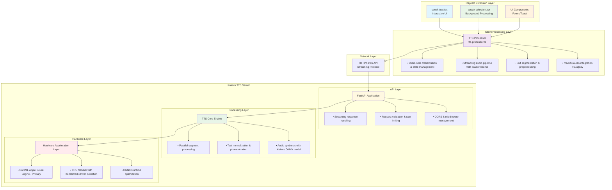

# Kokoro TTS Raycast Extension

A production-ready Text-to-Speech extension for Raycast that leverages the Kokoro ONNX model through a sophisticated client-server architecture optimized for real-time audio streaming and macOS integration.

---

## Audio Playback Architecture (2024)

**Current Playback Flow:**
- The extension uses **sox** as the primary audio playback tool, with **ffplay** as a fallback.
- Both are invoked via child processes, and the extension attempts multiple absolute paths (e.g., `/opt/homebrew/bin/sox`, `/usr/local/bin/sox`) to work around Raycast's restricted PATH environment.
- If neither sox nor ffplay is found, playback will fail with a clear error message.
- **Node-native playback** (using the `speaker` module) is **not supported in Raycast** due to native module resolution and sandboxing limitations, but works in standard Node.js CLI tools.

**Why not afplay?**
- afplay does not support real-time streaming PCM audio via stdin, and is unreliable for our streaming use case.
- sox and ffplay are more robust for both file and streaming playback, and are widely available via Homebrew.

---

## Test WAV Playback Results

You can run the `Test WAV Playback` command in Raycast to verify playback compatibility:
- **Sox Playback:** Should succeed if sox is installed and accessible via an absolute path.
- **Ffplay Playback:** Should succeed if ffplay is installed and accessible via an absolute path.
- **Speaker Playback:** Will fail in Raycast ("Could not find module root" or similar error), but works in CLI tools.
- **PATH:** Will show as undefined in Raycast; this is expected due to sandboxing.

**If both sox and ffplay fail:**
- Ensure you have sox and/or ffplay installed via Homebrew:
  ```sh
  brew install sox ffmpeg
  ```
- If installed, check their absolute paths (e.g., `/opt/homebrew/bin/sox`).
- The extension will try these paths automatically, but you can add symlinks if needed.

---

## Troubleshooting Playback in Raycast

- **Playback fails with ENOENT:**
  - sox/ffplay is not found. Install via Homebrew and ensure they are in `/opt/homebrew/bin` or `/usr/local/bin`.
- **Speaker playback fails with module root error:**
  - This is expected in Raycast. Node-native playback is not supported in the extension environment.
- **No audio output:**
  - Check your system audio settings and permissions.
  - Try running sox/ffplay directly from the terminal to verify they work.
- **Test WAV Playback command:**
  - Use this command to debug playback issues and see detailed logs in the Raycast extension console.

---

## Note on CLI vs Raycast
- The Node.js `speaker` module can be used for playback in CLI tools, but not in Raycast extensions.
- For Raycast, rely on sox/ffplay for robust playback.

---

## Architecture Overview

This extension implements a **multi-layered architecture** designed for performance, reliability, and user experience:



## Core Architectural Decisions

### 1. Client-Server Separation

**Why**: The Kokoro ONNX model requires significant computational resources and hardware acceleration. Running it directly within the Raycast extension would:
- Block the Raycast UI during inference
- Require bundling large ML models with the extension
- Prevent hardware optimization (CoreML, Neural Engine)
- Make resource management and caching impossible

**Solution**: A dedicated FastAPI server handles all TTS processing, allowing the Raycast extension to focus on UI/UX while the server optimizes for performance.

### 2. Streaming Audio Architecture

**Why Traditional Approach Fails**:
```typescript
//  Traditional: Wait for complete audio before playback
await fetch('/synthesize') → wait 5-10 seconds → play entire audio
```

**Our Streaming Solution**:
```typescript
// ✅ Streaming: Audio plays as it's generated
fetch('/synthesize', {stream: true}) → play chunks as they arrive
```

**Benefits**:
- **Reduced perceived latency**: Audio starts playing within 200-500ms
- **Better user experience**: No long loading delays
- **Memory efficiency**: No need to buffer entire audio files
- **Interruptible**: Can pause/stop mid-generation

### 3. Text Segmentation Strategy

**The Problem**: Kokoro has a 2000-character limit, but even shorter texts benefit from segmentation.

**Our Multi-Level Approach**:
1. **Paragraph-level splitting**: Natural content boundaries
2. **Sentence-level splitting**: Maintains speech rhythm
3. **Hard splitting**: Fallback for edge cases (very long words)

```typescript
// Example segmentation:
"A very long article..." → [
  "First paragraph with natural breaks.",
  "Second paragraph continues the thought.",
  "Final paragraph completes the content."
]
```

**Why This Works**:
- **Parallel processing**: Multiple segments synthesize simultaneously
- **Natural pauses**: Better speech flow than concatenated audio
- **Error resilience**: One failed segment doesn't break entire synthesis
- **Streaming compatibility**: Segments can stream as they complete

### 4. macOS-Optimized Audio Pipeline

**Why afplay Instead of Web Audio**:
- **Native integration**: Leverages macOS audio subsystem
- **Hardware acceleration**: Uses built-in audio processing
- **System compatibility**: Works with all macOS audio configurations
- **Background playback**: Continues when Raycast is closed

**Temporary File Strategy**:
```typescript
// Why temporary files vs in-memory streaming:
const tempFile = join(tmpdir(), `kokoro-${timestamp}.wav`);
await writeFile(tempFile, audioData);
spawn('afplay', [tempFile]); // ✅ Reliable, hardware-accelerated
```

**Benefits**:
- **Reliability**: afplay handles all audio format complexities
- **Performance**: Optimized for Apple hardware
- **Compatibility**: Works across all macOS versions
- **Resource management**: Automatic cleanup prevents memory leaks

### 5. State Management & Pause/Resume

**The Challenge**: Streaming audio with pause/resume requires careful state coordination.

**Our Solution**:
```typescript
class TTSSpeechProcessor {
  private isPaused = false;
  private resumeCallback: (() => void) | null = null;

  // Streaming pause: halt reading stream
  while (reading) {
    if (this.isPaused) {
      await new Promise<void>(resolve => this.resumeCallback = resolve);
    }
    // Continue reading...
  }
}
```

**Why This Works**:
- **Granular control**: Can pause mid-sentence
- **Resource efficiency**: Doesn't waste processing during pause
- **User experience**: Immediate response to controls
- **State consistency**: Prevents race conditions

### 6. Performance Optimization Strategy

**Hardware Detection & Benchmarking**:
```typescript
// Automatic provider selection based on performance
const providers = ['CoreMLExecutionProvider', 'CPUExecutionProvider'];
const benchmarkResults = await benchmarkProviders();
const optimalProvider = selectBestProvider(benchmarkResults);
```

**Why This Matters**:
- **Apple Silicon**: 3-5x faster with CoreML + Neural Engine
- **Intel Macs**: CPU optimization still provides benefits
- **Automatic fallback**: Graceful degradation when hardware acceleration fails
- **Real-world testing**: Benchmark with actual model, not synthetic tests

### 7. Error Handling & Resilience

**Multi-Level Fallback Strategy**:
1. **Primary**: CoreML with hardware acceleration
2. **Secondary**: CPU-based processing
3. **Tertiary**: Text preprocessing fallback (remove problematic characters)
4. **Final**: Graceful error reporting

**Why This Approach**:
- **Production reliability**: Handles edge cases gracefully
- **User experience**: Provides feedback rather than silent failures
- **Debugging**: Comprehensive logging for issue diagnosis
- **Maintainability**: Clear error boundaries

## Features & Implementation

###  **High-Quality TTS with Kokoro ONNX**
- **67 voices** across 9 languages with quality grades
- **Neural speech synthesis** using state-of-the-art models
- **Hardware acceleration** on Apple Silicon (CoreML + Neural Engine)

###  **Real-Time Streaming Audio**
- **Sub-second latency**: Audio starts playing within 200-500ms
- **Chunk-based processing**: 50ms audio chunks for smooth playback
- **Intelligent buffering**: Balances latency vs. quality

###  **Advanced Playback Controls**
- **Pause/Resume**: Mid-sentence control without audio gaps
- **Speed adjustment**: 0.1x to 3.0x with pitch preservation
- **Stop/Restart**: Immediate response with proper cleanup

###  **Smart Text Processing**
- **Automatic segmentation**: Optimizes for natural speech rhythm
- **Preprocessing**: Handles problematic characters and formatting
- **Length optimization**: Respects model limits while maintaining context

### **Performance Optimizations**
- **Parallel processing**: Multiple segments synthesize simultaneously
- **Streaming pipeline**: Audio plays while generating
- **Memory efficiency**: Temporary files prevent memory leaks
- **Hardware detection**: Automatic optimization for your Mac

## Commands

### 1. Speak Text (Interactive)
Full-featured interface with real-time configuration:
- Text input with clipboard auto-loading
- Voice selection from 67 options
- Speed adjustment (0.1x - 3.0x)
- Streaming toggle
- Real-time playback controls

### 2. Speak Selected Text (Background)
Instant TTS for selected text:
- Immediately processes selected text
- Uses your default preferences
- Background operation with toast notifications
- Optimized for quick, frequent use

## Installation & Setup

### 1. Start the TTS Server
```bash
cd /path/to/kokoro-onnx
./start_development.sh  # Development with hot reload
# or
./start_production.sh   # Production with optimization
```

### 2. Install Extension
```bash
cd raycast
npm install
npm run dev
```

### 3. Configure Preferences (Optional)
- **Server URL**: Default `http://localhost:8080`
- **Default Voice**: Recommended `af_heart` (high quality)
- **Default Speed**: `1.0x` (natural pace)
- **Streaming**: Enabled (recommended for performance)

## Advanced Configuration

### Server Performance Tuning
```python
# Environment variables for optimization
export KOKORO_BENCHMARK_PROVIDERS=true  # Enable automatic benchmarking
export ONNX_PROVIDER=CoreMLExecutionProvider  # Force CoreML (Apple Silicon)
export KOKORO_MAX_CONCURRENT_SEGMENTS=4  # Parallel processing limit
```

### Client-Side Optimization
```typescript
// Raycast extension preferences
{
  "useStreaming": true,        // Enable streaming for better latency
  "sentencePauses": true,      // Natural pauses between sentences
  "maxSentenceLength": 100     // Optimize segment length
}
```

## Voice Catalog

| Language | Count | Examples | Quality Range |
|----------|-------|----------|---------------|
|  American English | 22 | af_heart, am_adam, af_bella | A-C |
|  British English | 8 | bf_emma, bm_george | B-C |
|  Japanese | 6 | jf_gongitsune, jm_kumo | B-C |
|  Mandarin | 8 | zf_xiaobei, zm_yunxi | B-C |
|  Spanish | 3 | ef_dora, em_alex | B-C |
|  French | 1 | ff_siwis | B |
|  Hindi | 4 | hf_alpha, hm_omega | B-C |
|  Italian | 2 | if_sara, im_nicola | B-C |
|  Portuguese | 3 | pf_dora, pm_alex | B-C |

## Troubleshooting

### Server Issues
```bash
# Check server status
curl http://localhost:8080/health

# Monitor server logs
tail -f server.log

# Test with CoreML
ONNX_PROVIDER=CoreMLExecutionProvider python api/main.py
```

### Audio Issues
```bash
# Test afplay directly
afplay /System/Library/Sounds/Ping.aiff

# Check audio permissions
system_profiler SPAudioDataType
```

### Performance Issues
```bash
# Enable benchmarking
export KOKORO_BENCHMARK_PROVIDERS=true

# Monitor resource usage
top -pid $(pgrep -f "python.*main.py")
```

## Development & Contributing

### Architecture Tests
```bash
# Test streaming pipeline
npm run test:streaming

# Test audio processing
npm run test:audio

# Test error handling
npm run test:resilience
```

### Code Quality
```bash
npm run lint      # TypeScript linting
npm run type-check  # Type validation
npm run test      # Unit tests
```

## Performance Benchmarks

On Apple Silicon (M1/M2/M3):
- **First audio chunk**: ~200ms
- **Streaming latency**: ~50ms per chunk
- **CoreML acceleration**: 3-5x faster than CPU
- **Memory usage**: ~100MB for model + streaming buffers

## License

MIT License - Built for the developer community with 

---

*This extension represents a production-ready implementation of streaming TTS with modern web technologies, hardware acceleration, and user-centric design principles.*
